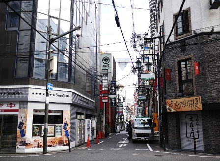
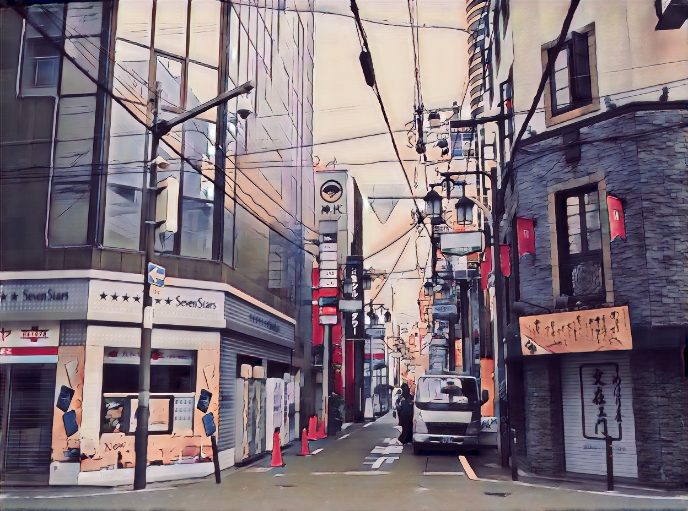
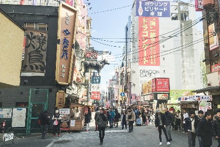
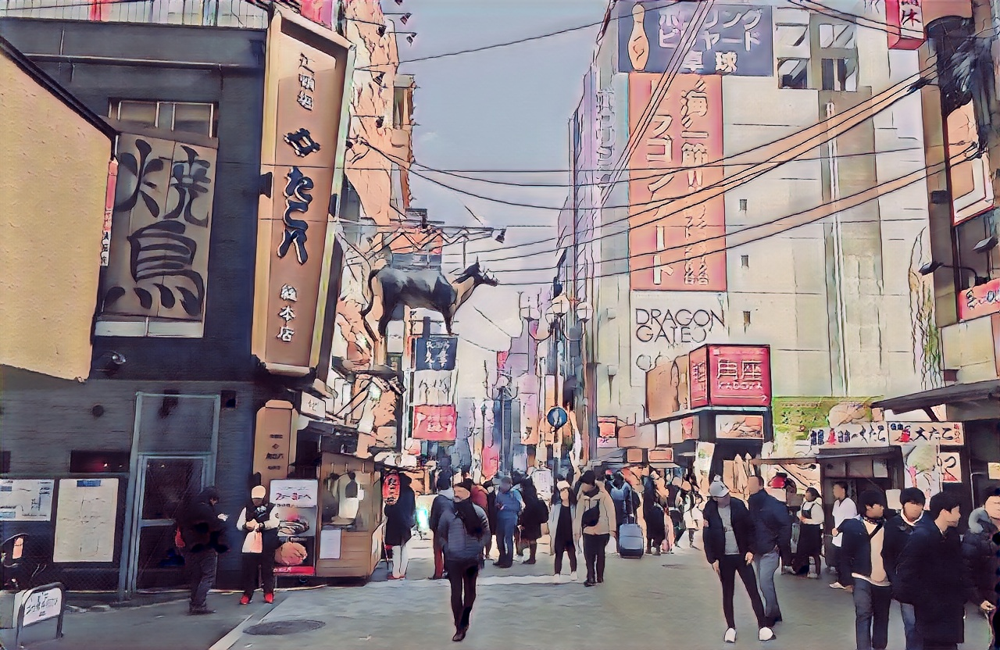
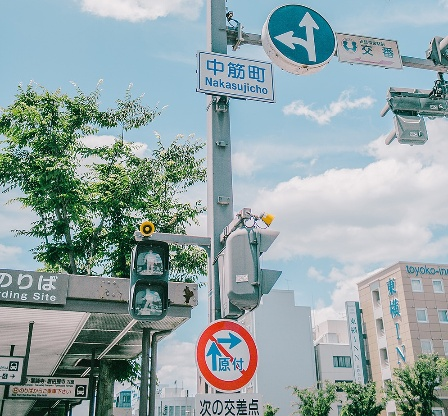
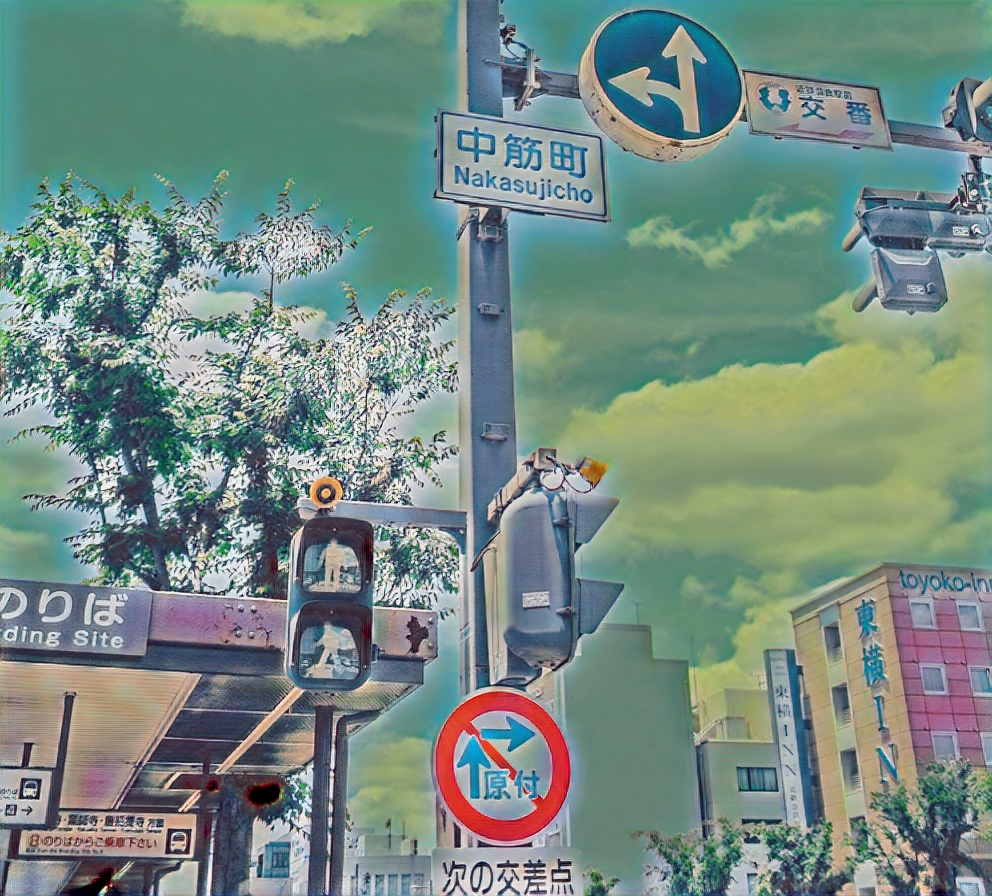
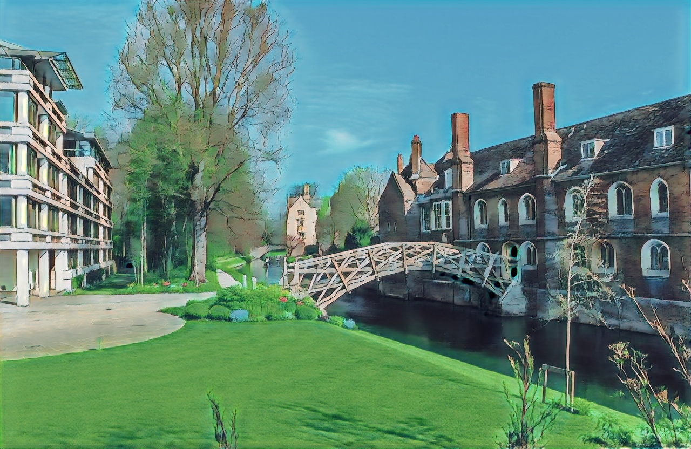
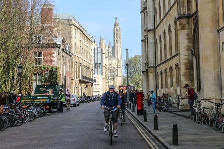
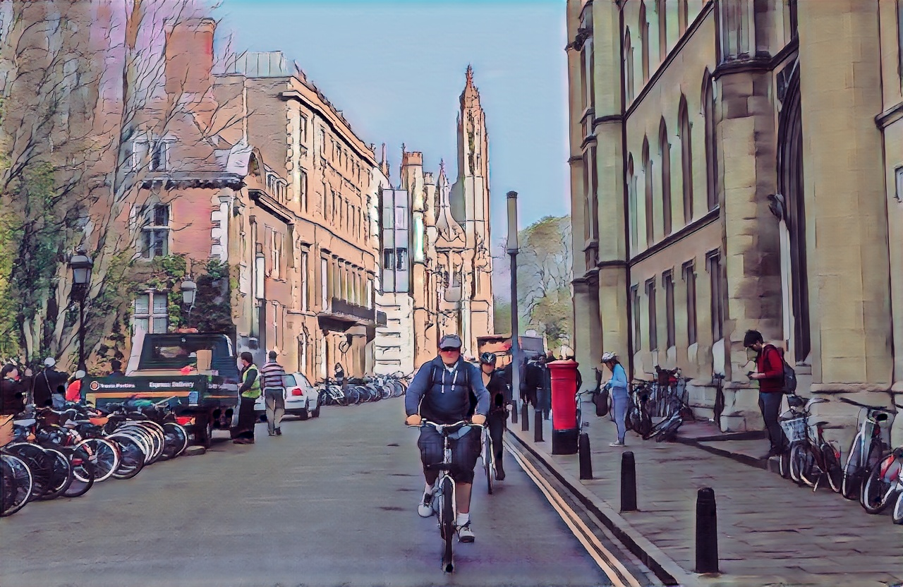
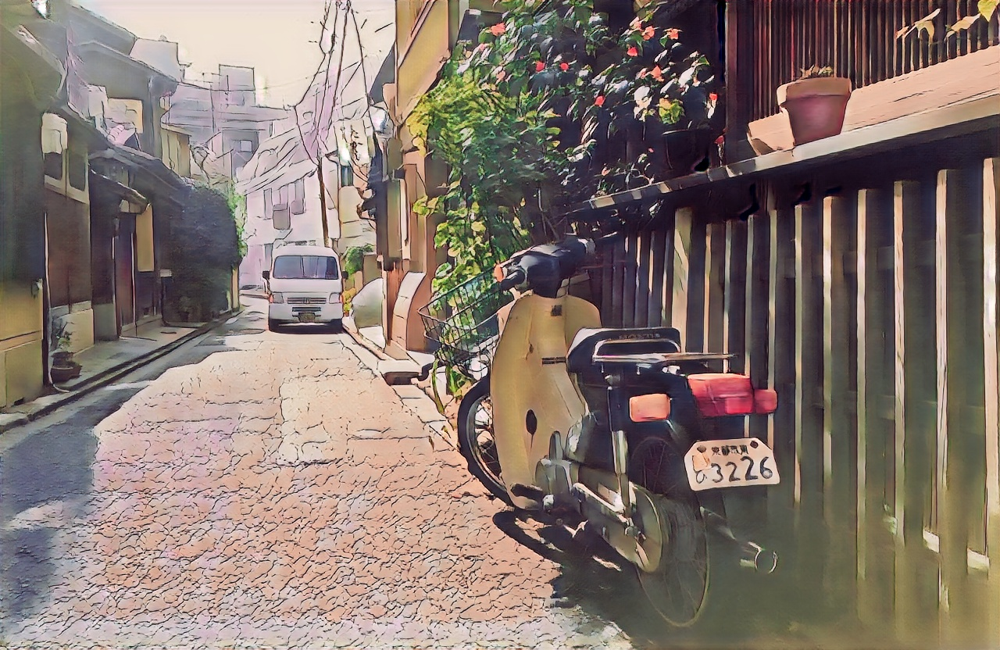

# AnimeGAN Pytorch <a href="https://colab.research.google.com/github/ptran1203/pytorch-animeGAN/blob/master/notebooks/animeGAN_inference.ipynb" target="_parent"></a>

Pytorch implementation of AnimeGAN for fast photo animation

* Paper: *AnimeGAN: a novel lightweight GAN for photo animation* - [Semantic scholar](https://www.semanticscholar.org/paper/AnimeGAN%3A-A-Novel-Lightweight-GAN-for-Photo-Chen-Liu/10a9c5d183e7e7df51db8bfa366bc862262b37d7#citing-papers) or from [Yoshino repo](https://github.com/TachibanaYoshino/AnimeGAN/blob/master/doc/Chen2020_Chapter_AnimeGAN.pdf)
* Original implementation in [Tensorflow](https://github.com/TachibanaYoshino/AnimeGAN) by [Tachibana Yoshino](https://github.com/TachibanaYoshino)
* [Demo and Docker image on Replicate](https://replicate.ai/ptran1203/pytorch-animegan)


| Input | Animation |
|--|--|
|||

## Documentation

- Training notebook on [Google colab](https://colab.research.google.com/github/ptran1203/pytorch-animeGAN/blob/master/notebooks/animeGAN.ipynb)
- Inference notebook on [Google colab](https://colab.research.google.com/github/ptran1203/pytorch-animeGAN/blob/master/notebooks/animeGAN_inference.ipynb)


### 1. Prepare dataset

#### 1.1 To download dataset from paper, run below command

```bash
wget -O anime-gan.zip https://github.com/ptran1203/pytorch-animeGAN/releases/download/v1.0/dataset_v1.zip
unzip anime-gan.zip -d /content
```

=>  The dataset folder can be found in your current folder with name `dataset`

#### 1.2 Create custom data from anime video

You need to have a video file located in your machine, for example: [`/home/ubuntu/Downloads/kimetsu_yaiba.mp4`](https://www.youtube.com/watch?v=ZMeGdt8QJfY)

**Step 1.** Create anime images from the video

```bash
python3 script/video_to_images.py --video-path /home/ubuntu/Downloads/kimetsu_yaiba.mp4\
                                --save-path dataset/Kimetsu/style\
                                --max-image 1800\
                                --image-size 256\
```

**Step 2.** Create edge-smooth version of dataset from **Step 1.**

```bash
python3 script/edge_smooth.py --dataset Kimetsu --image-size 256
```

### 2. Train animeGAN

To train the animeGAN from command line, you can run `train.py` as the following:

```bash
python3 train.py --dataset Hayao\           # Can be Hayao, Shinkai, Kimetsu, Paprika, SummerWar or {your custom data in step 1.2}
                --batch 6\
                --init-epochs 4\
                --checkpoint-dir {ckp_dir}\
                --save-image-dir {save_img_dir}\
                --save-interval 1\
                --gan-loss lsgan\           # one of [lsgan, hinge, bce]
                --init-lr 0.0001\
                --lr-g 0.00002\
                --lr-d 0.00004\
                --wadvd 10.0\               # Aversarial loss weight for D
                --wadvg 10.0\               # Aversarial loss weight for G
                --wcon 1.5\                 # Content loss weight
                --wgra 3.0\                 # Gram loss weight
                --wcol 30.0\                # Color loss weight
                --resume GD\                # if set, G to start from pre-trained G, GD to continue training GAN
                --use_sn\                   # If set, use spectral normalization, default is False
```

### 3. Transform images

To convert images in a folder or single image, run `inference_image.py`, for example:

> --src and --dest can be a directory or a file

```bash
python3 inference_image.py --checkpoint {ckp_dir}\
                        --src /content/test/HR_photo\
                        --dest {working_dir}/inference_image_v2\
```

### 4. Transform video

To convert a video to anime version, run `inference_video.py`, for example:

> Be careful when choosing --batch-size, it might lead to CUDA memory error if the resolution of the video is too large

```bash
python3 inference_video.py --checkpoint {ckp_dir}\
                        --src /content/test_vid_3.mp4\
                        --dest /content/test_vid_3_anime.mp4\
                        --batch-size 2
```

## Anime transformation results ([see more](https://github.com/ptran1203/pytorch-animeGAN/releases/download/v1.0/results.zip))


| Input | Output(Hayao style) |
|--|--|
|||
|||
|||
|||
|||
|||


## Check list

- [x] Add Google Colab
- [ ] Add implementation details
- [x] Add and train on other data

<!-- ### Objective:

- Learn to map photo domain **P** to animation domain **A**.
- **AnimeGAN** is Trained using unpaired data includes N photos and M animation images:
    + S(p) = {p(i) | i = 1, ..., N} ⊂ **P**
    + S(a) = {a(i) | i = 1, ..., M} ⊂ **A**
    + S(x) = {x(i) | i = 1, ..., M} ⊂ **X**, grayscale version of **A**
    + S(e) = {e(i) | i = 1, ..., N} ⊂ **E**, Obtained by removing the edges of **A**
    + S(y) = {y(i) | i = 1, ..., N} ⊂ **Y**, grayscale version of **E**

#### Loss functions

- Grayscale Gram matrix to make G(x) have the texture of anime images instread of color (transfer texture, not color)

Loss function

```
L(G, D) = W(adv)L(adv)(G, D) + W(con)L(con)(G, D) + W(gra)L(gra)(G, D) + W(col)L(col)(G,D)
```

1. Adversarial loss (LSGAN)

```
L(adv)(D) = 0.5 * (D(x_anime) - 1)^2 + 0.5 * (D(G(x_photo)))^2

L(adv)(G) = 0.5 (D(G(x_photo)) - 1)^2
```

2. Content loss

```
L(con)(G, D) = ||VGG(x_photo) - VGG(G(x_photo))||
```

3. Gram matrix loss

```
L(gra)(G, D) = ||gram(VGG(G(x_photo))) - Gram(VGG(x_anime_gray))||
```

4. Color recontruction loss

```
L(col)(G, D) = || Y(G(x_photo)) - Y(x_photo) || + Huber(|| U(G(x_photo)) - U(x_photo) ||)
    + Huber(|| V(G(x_photo)) - V(x_photo) ||)
``` -->
