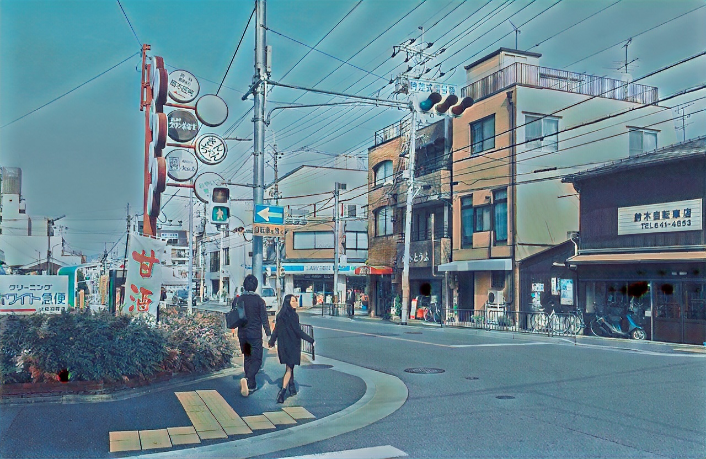
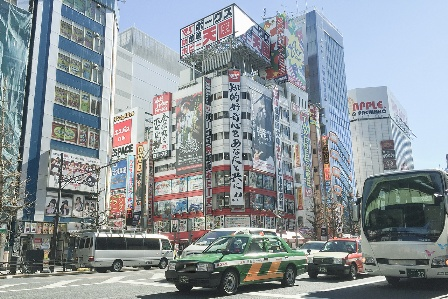
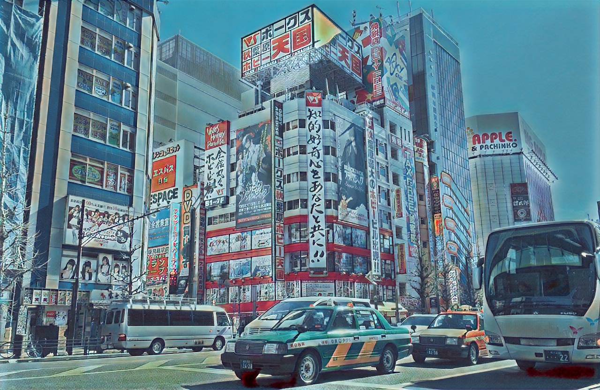
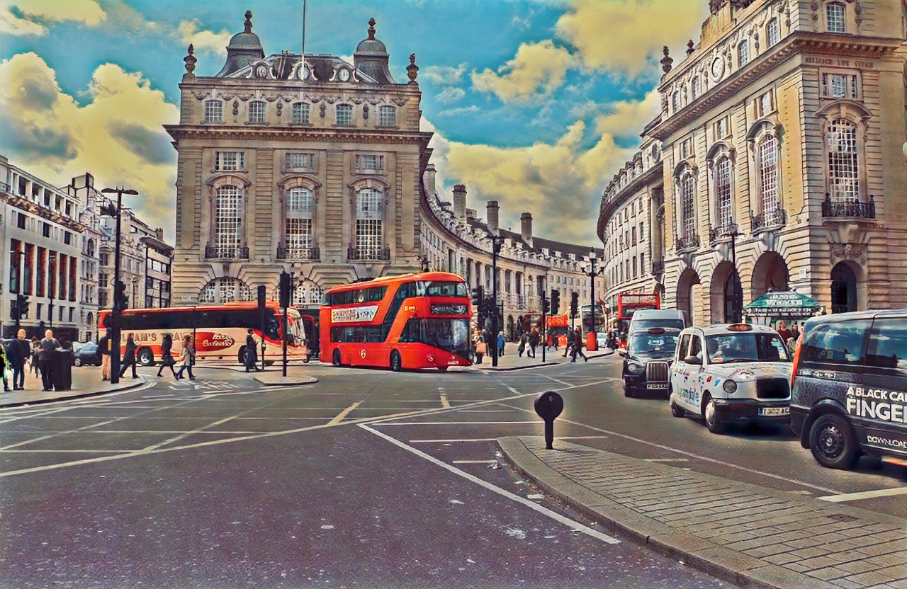
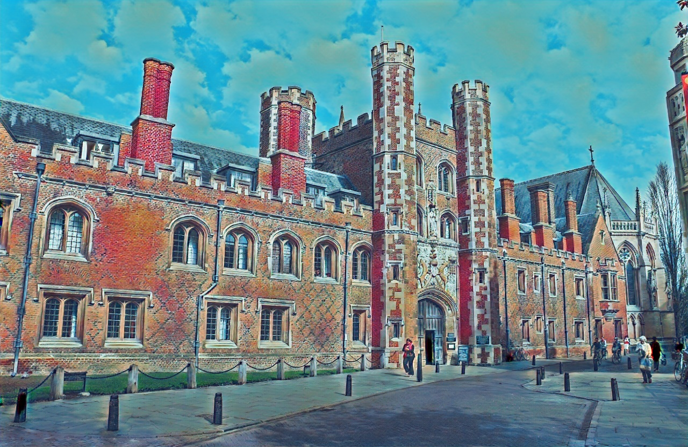

# AnimeGAN Pytorch

Pytorch implementation of AnimeGAN for fast photo animation

* Paper: AnimeGAN: a novel lightweight GAN for photo animation - [semanticscholar](https://www.semanticscholar.org/paper/AnimeGAN%3A-A-Novel-Lightweight-GAN-for-Photo-Chen-Liu/10a9c5d183e7e7df51db8bfa366bc862262b37d7#citing-papers) or [here](https://github.com/TachibanaYoshino/AnimeGAN/blob/master/doc/Chen2020_Chapter_AnimeGAN.pdf)
* Original implementation in [Tensorflow](https://github.com/TachibanaYoshino/AnimeGAN) by [Yoshino](https://github.com/TachibanaYoshino)


| Input | Animation |
|--|--|
|||

## Stylization results


Optimizing code for good results...

<!-- | Input | Output |
|--|--|
|||
|||
|||
|||
||| -->


<!-- ### Objective:

- Learn to map photo domain **P** to animation domain **A**.
- **AnimeGAN** is Trained using unpaired data includes N photos and M animation images:
    + S(p) = {p(i) | i = 1, ..., N} ⊂ **P**
    + S(a) = {a(i) | i = 1, ..., M} ⊂ **A**
    + S(x) = {x(i) | i = 1, ..., M} ⊂ **X**, grayscale version of **A**
    + S(e) = {e(i) | i = 1, ..., N} ⊂ **E**, Obtained by removing the edges of **A**
    + S(y) = {y(i) | i = 1, ..., N} ⊂ **Y**, grayscale version of **E**

#### Loss functions

- Grayscale Gram matrix to make G(x) have the texture of anime images instread of color (transfer texture, not color)

Loss function

```
L(G, D) = W(adv)L(adv)(G, D) + W(con)L(con)(G, D) + W(gra)L(gra)(G, D) + W(col)L(col)(G,D)
```

1. Adversarial loss (LSGAN)

```
L(adv)(D) = 0.5 * (D(x_anime) - 1)^2 + 0.5 * (D(G(x_photo)))^2

L(adv)(G) = 0.5 (D(G(x_photo)) - 1)^2
```

2. Content loss

```
L(con)(G, D) = ||VGG(x_photo) - VGG(G(x_photo))||
```

3. Gram matrix loss

```
L(gra)(G, D) = ||gram(VGG(G(x_photo))) - Gram(VGG(x_anime_gray))||
```

4. Color recontruction loss

```
L(col)(G, D) = || Y(G(x_photo)) - Y(x_photo) || + Huber(|| U(G(x_photo)) - U(x_photo) ||)
    + Huber(|| V(G(x_photo)) - V(x_photo) ||)
``` -->
